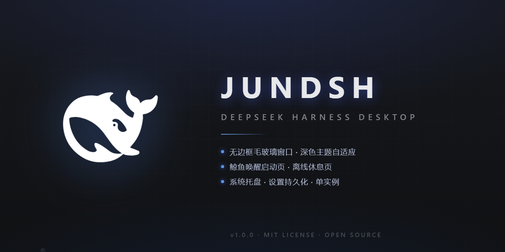
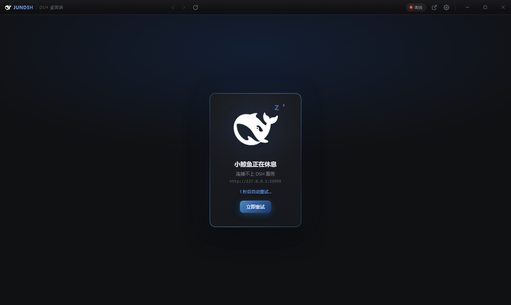

# JUNDSH · DSH 桌面端 🐳

黑色鲸鱼标志的 DeepSeek Harness 桌面客户端。

<p align="center">
  <a href="https://github.com/junagent/jundsh-desktop/releases"></a>
  <a href="https://github.com/junagent/jundsh-desktop/blob/main/LICENSE"></a>
  
  <a href="https://github.com/junagent/jundsh-desktop/actions"></a>
</p>

<p align="center">
  
</p>

## 功能

- 🐳 **黑色鲸鱼标志**：应用图标（白底黑鲸）、托盘、标题栏、启动画面全部使用官方鲸鱼标志 —— 浅色主题下显示黑色，深色主题下自动切换为白色
- 🪟 **无边框玻璃窗口**：自定义毛玻璃标题栏（Mica 亚克力背景）、鲸鱼 logo、连接状态胶囊、后退/前进/刷新/浏览器打开
- 🌗 **外观自适应**：跟随系统 / 浅色 / 深色三种模式，标题栏外壳与 DSH 网页端主题实时联动
- 🚀 **鲸鱼唤醒启动页**：启动时显示气泡漂浮的鲸鱼动画，加载完成后平滑消失
- 😴 **离线休息页**：DSH 服务不可达时显示「小鲸鱼正在休息」+ 漂浮 Zzz，5 秒自动重试 + 手动重试
- 🖥️ **系统托盘**：关闭窗口默认最小化到托盘，托盘菜单支持显示/刷新/设置/退出
- ⚙️ **设置**：服务地址、界面缩放（50%–200%，Ctrl+±/0 快捷）、关闭到托盘开关、外观模式、开机自启
- ⚙️ **DSH 服务管理（v1.3）**：支持 external/profile/source 三种模式；托管模式下由客户端拉起 DSH 服务并做健康检查 + 看门狗自动重启；标题栏状态胶囊展示端口/模式/运行时长，设置面板内有服务启停/重启与控制台状态
- 🩺 **环境诊断（v1.3）**：一键生成环境诊断报告（Node/DSH Profile/源码目录/端口探测 + 问题清单），可复制分享
- ⌨️ **内置终端（v1.3）**：标题栏按钮或 `Ctrl`+`` ` `` 快捷呼出 PowerShell 终端抽屉（IPC 串流，零原生依赖）；支持**命令历史**（↑/↓）、`Ctrl+L` 清屏、cwd 状态栏
- 🐋 **桌面悬浮鲸鱼**：官方黑鲸（深色主题自动切白鲸）悬空于桌面；可**拖动、双击回主界面、右键菜单**；拖到屏幕边缘自动**吸附成小条**（悬停浮出、**重启记忆吸附状态**），菜单颜色跟随皮肤；托盘菜单可一键开关
- 🎨 **皮肤主题**：深蓝 / 极光紫 / 翡翠 / 琥珀 四套预设，token 化即时预览
- 😴 **离线页**：5 秒自动重试 + 「一键启动服务」（托管模式下直接拉起 DSH）
- 🔗 **外部链接**：页面中的外部链接自动用系统浏览器打开，下载文件自动存入下载目录
- 🪟 **窗口记忆**：记住窗口位置与最大化状态，关闭后原样恢复
- 🔑 单实例运行
- 🔄 **自动更新**：基于 GitHub Releases，启动后自动检查新版本，下载完成通知重启安装（托盘菜单可手动检查；仅安装版支持，便携版请用安装版以享受自动更新）

## 界面预览

<p align="center">
  
</p>

> 视觉语言参考 DeepSeek Harness 官网：品牌蓝 `#679EFE`、旋转渐变边框、玻璃拟态、微网格与光晕。

## 开发

```bash
npm install       # 安装依赖
npm start         # 开发模式启动（连接 http://127.0.0.1:8080）
npm run check     # 语法检查
npm run smoke     # DSH 服务管理冒烟（拉起 profile 服务 + 看门狗自愈）
npm run icons     # 重新生成鲸鱼图标（读 assets/whale.svg）
npm run branding  # 重新生成品牌宣传图（Electron 渲染）
npm run dist      # 打包 Windows 安装包 (NSIS + 便携版)
```

> 开发模式下 DSH 服务默认 external：请先运行 `start-dsh-web.ps1` 启动 8080，
> 或在外壳设置里切到「托管·Profile / 托管·源码」模式由客户端自动拉起。

发布新版本（自动更新依赖 GitHub Release）：

```bash
npm version patch   # 或 minor / major
git push --follow-tags   # CI 自动构建并发布 Release（.github/workflows/build.yml）
```

> CI 使用 `GITHUB_TOKEN` 自动发布，无需手动上传安装包。

打包产物位于 `release/`：
- `JUNDSH-Setup-x.y.z.exe` — 安装版（**推荐**，支持自动更新）
- `JUNDSH-x.y.z-portable.exe` — 免安装便携版（⚠️ 不支持自动更新，需手动下载新版覆盖）

> 国内网络打包时建议设置镜像：
> ```bash
> $env:ELECTRON_MIRROR='https://npmmirror.com/mirrors/electron/'
> $env:ELECTRON_BUILDER_BINARIES_MIRROR='https://npmmirror.com/mirrors/electron-builder-binaries/'
> ```

## 配置

设置保存在 `%APPDATA%\JUNDSH\settings.json`（首次启动自动创建，并自动迁移旧版目录的设置）：

```json
{
  "targetUrl": "http://127.0.0.1:8080",
  "minimizeToTray": true,
  "zoomFactor": 1,
  "theme": "system"
}
```

## 快捷键

| 按键 | 功能 |
| --- | --- |
| `Ctrl` + `=` / `-` | 缩放界面 |
| `Ctrl` + `0` | 恢复 100% 缩放 |
| `` Ctrl `` + `` ` `` | 打开/关闭终端抽屉 |
| `Ctrl` + `L`（终端内） | 清空终端输出 |
| `↑` / `↓`（终端内） | 命令历史 |
| `F12` / `Ctrl+Shift+I` | 开发者工具 |
| `Esc` | 关闭设置弹窗 |

## 项目结构

```
dsh-desktop/
├── assets/            # 鲸鱼 SVG（whale.svg 官方标志，浅色黑/深色白自适应）
│   └── branding/      # 品牌宣传图（朋友圈方形图 / GitHub social preview / 透明 logo）
├── build/             # 生成的应用图标（icon.ico / icon.png / tray.png，白底黑鲸）
├── scripts/
│   ├── gen-icons.mjs      # 图标生成器（解析鲸鱼路径、自动居中、多尺寸）
│   └── gen-branding.mjs   # 品牌图生成器（Electron 渲染：方形 1080 / social 1280x640 / logo 512）
├── src/
│   ├── main.js        # 主进程：窗口/托盘/主题/设置/下载/单实例
│   ├── preload.js     # 安全桥接
│   ├── shell.html/css/js  # 桌面外壳：毛玻璃标题栏 + webview + 离线页 + 设置
│   └── splash.html    # 鲸鱼启动动画
└── screenshots/       # 调试截图（DSH_DESKTOP_SHOT=1 时生成）
```

## 调试

```bash
DSH_DESKTOP_SHOT=1 electron .   # 启动后自动截图到 %APPDATA%\JUNDSH\screenshots 并退出
DSH_DESKTOP_SHOT=modal electron .  # 额外打开设置弹窗再截图
```
